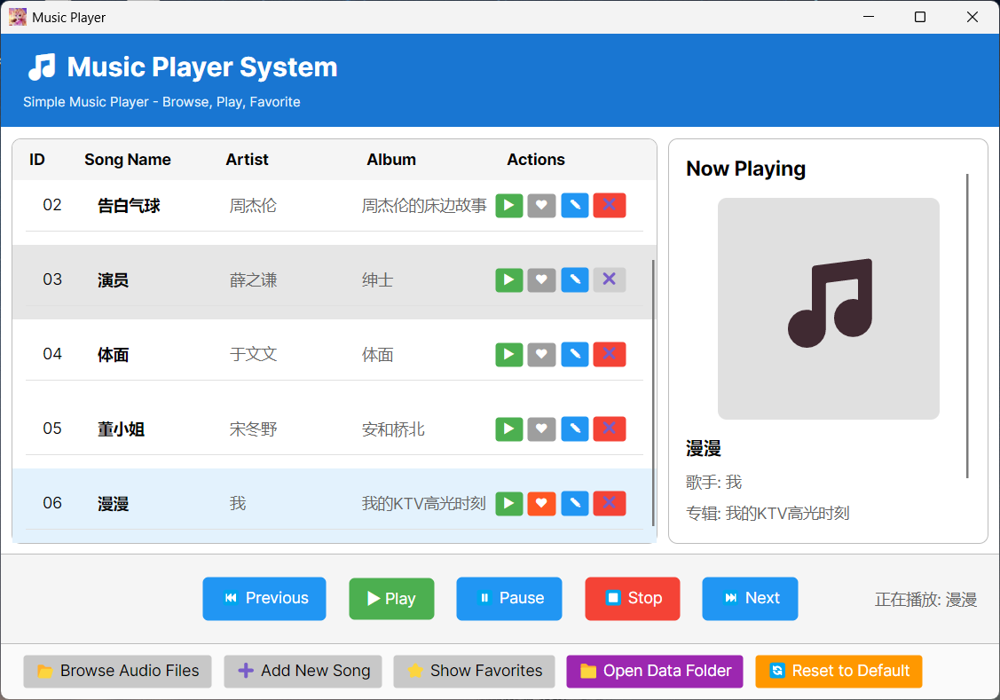

# 音乐播放器

一个基于 Avalonia UI 框架和 .NET 8 构建的简洁优雅的音乐播放器。



## 功能特性

- 🎵 **音频播放**: 支持多种音频格式播放（MP3、WAV、M4A、FLAC）
- ⭐ **收藏管理**: 标记您喜爱的歌曲
- 📝 **歌曲管理**: 添加、编辑和删除歌曲库中的歌曲
- 📁 **文件浏览**: 从计算机导入音频文件
- 💾 **数据持久化**: 自动保存您的歌曲库和收藏
- 🎨 **现代化界面**: 简洁直观的用户界面，采用 Fluent 设计
- 🎛️ **播放控制**: 播放、暂停、停止、上一首、下一首控制
- 🔄 **重置功能**: 带确认对话框的重置到默认歌曲列表功能

## 技术栈

- **框架**: Avalonia UI 11.3.6
- **运行时**: .NET 8.0
- **音频库**: NAudio 2.2.1
- **数据存储**: System.Text.Json 8.0.0

## 项目结构

```
Music/
├── Assets/
│   ├── DefaultSongs/          # 默认歌曲文件
│   └── logo.ico               # 应用程序图标
├── Services/
│   ├── AudioPlayerService.cs  # 音频播放服务
│   └── MusicDataService.cs    # 数据持久化服务
├── MainWindow.axaml           # 主窗口 UI
├── MainWindow.axaml.cs        # 主窗口逻辑
├── ManageSongWindow.axaml     # 歌曲管理窗口 UI
├── ManageSongWindow.axaml.cs  # 歌曲管理逻辑
├── ConfirmDialog.axaml        # 确认对话框 UI
├── ConfirmDialog.axaml.cs     # 确认对话框逻辑
├── App.axaml                  # 应用程序资源
├── App.axaml.cs               # 应用程序入口
└── Music.csproj               # 项目文件
```

## 环境要求

- [.NET 8.0 SDK](https://dotnet.microsoft.com/zh-cn/download/dotnet/8.0)

## 开始使用

### 1. 克隆仓库

```bash
git clone https://github.com/futurefe414/MusicPlayer.git
cd Music
```

### 2. 还原依赖

```bash
dotnet restore
```

### 3. 构建项目

```bash
dotnet build
```

### 4. 运行应用程序

```bash
dotnet run --project Music/Music.csproj
```

## 使用说明

### 播放音乐

1. 从列表中选择一首歌曲
2. 点击**播放**按钮或双击歌曲
3. 使用播放控制按钮暂停、停止或切换歌曲

### 管理歌曲

- **添加歌曲**: 点击**浏览**按钮从计算机导入音频文件
- **编辑歌曲信息**: 点击歌曲旁边的**编辑**按钮（✏️）修改歌曲详细信息
- **删除歌曲**: 点击**删除**按钮（🗑️）从歌曲库中移除歌曲
- **手动添加**: 点击**管理**按钮手动添加歌曲信息

### 收藏功能

- 点击歌曲旁边的**星标**图标（⭐）将其标记为收藏
- 点击**显示收藏**仅查看您收藏的歌曲
- 点击**显示全部歌曲**返回完整歌曲库

### 数据管理

- **打开数据文件夹**: 点击查看存储歌曲库数据的位置
- **重置**: 将应用程序恢复到默认状态，使用原始歌曲列表

## 数据存储

应用程序将数据存储在系统的 AppData 文件夹中：

- **Windows**: `%AppData%\MusicPlayer\`
- **macOS**: `~/Library/Application Support/MusicPlayer/`
- **Linux**: `~/.config/MusicPlayer/`

维护两个 JSON 文件：
- `songs.json`: 完整的歌曲库
- `favorites.json`: 收藏的歌曲 ID 列表

## 支持的音频格式

- MP3 (`.mp3`)
- WAV (`.wav`)
- M4A (`.m4a`)
- FLAC (`.flac`)

## 核心功能实现

### 音频播放服务 (AudioPlayerService)

使用 NAudio 库实现音频播放功能，支持：
- 播放、暂停、继续、停止
- 播放状态跟踪
- 自动资源清理

### 数据持久化服务 (MusicDataService)

使用 System.Text.Json 实现数据存储，功能包括：
- 歌曲库的保存和加载
- 收藏列表的保存和加载
- 数据文件管理
- 一键重置数据

### 用户界面

- **主窗口**: 显示歌曲列表、播放控制和歌曲信息
- **歌曲管理窗口**: 添加和编辑歌曲信息
- **确认对话框**: 重要操作的确认提示

## 许可证

本项目为开源项目，采用 MIT 许可证。

## 贡献

欢迎贡献！请随时提交 Pull Request。

## 代码仓库

[https://github.com/futurefe414/MusicPlayer](https://github.com/futurefe414/MusicPlayer)

## 联系方式

如有问题或建议，请在 GitHub 仓库中提交 Issue。
